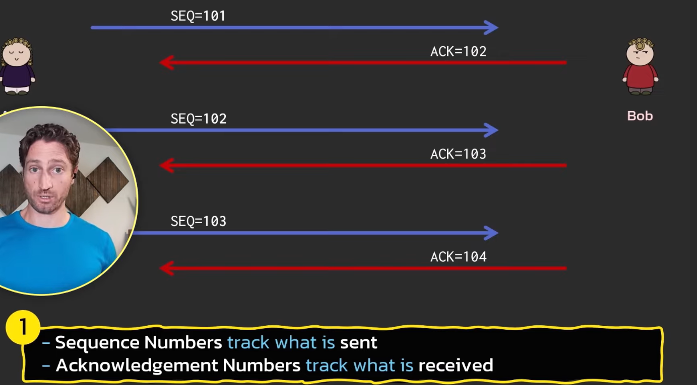
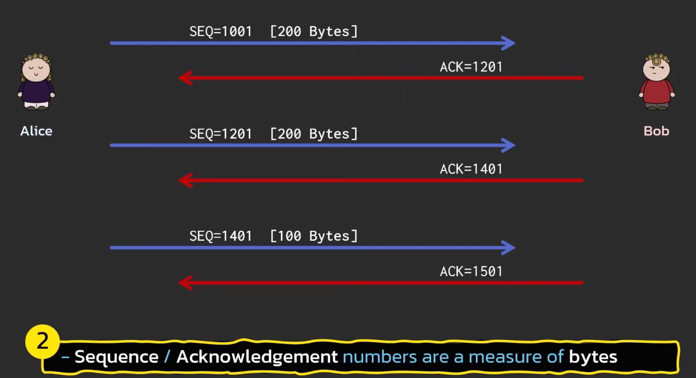
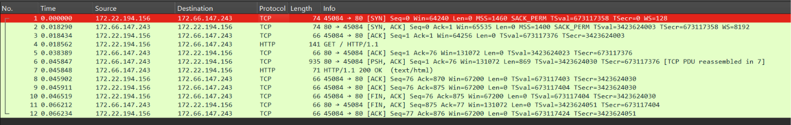

# Notes - Day 1

## Exercise 1

Ran the following in different tmux panes:

```bash
sudo tcpdump -nnvv -i any port 80

sudo python3 -m http.server 80

curl -v http://localhost:80
```

Stored the log from tcpdump in `tcpdump_2.log` file

Notes:

1. I can clearly see the SYN, SYN+ACK and ACK [3 Way Handshake] packets
2. The connection is established by the final ACK package from the client
3. After the ACK, i.e, after the connection is established, the client sends it's request,
   that is, the GET request with its Request headers with a [P.], [PSH+ACK] flag.
   GET / HTTP/1.1
   Host: localhost
   User-Agent: curl/7.81.0
   Accept: _/_
4. The server acknowledges the request with a [.] packet (ACK)
5. The server then sends the response headers
   HTTP/1.0 200 OK
   Server: SimpleHTTP/0.6 Python/3.10.12
   Date: Mon, 14 Sep 2026 13:08:19 GMT
   Content-type: text/html; charset=utf-8
   Content-Length: 2462
6. The client acknowledges the response headers with a [.] packet
7. The server sends a humongous Length 2462 packet with a [P.], which the client acknowledges
8. Server sends a [F.] packet, asking to gracefully FINish the connection
9. The client responds with a [F.]
    - Since TCP is a full-duplex connection (two-way), each side must sends it's own [FIN] flag and receive an acknowledgement [ACK] to completely shut things down.
10. The server sends the final acknowledgement to the client's [F.] packet, and the connection is closed.

## Sequence Number and Acknowledgement Number




1. Seq number + payload length = ack number -> it means that the receiver has received everything before the ack number it sends
2. Example: sender: seq 1001, length 200 => receiver: ack: 1201 -> means that the receiver has received everything before the seq number 1201 OR that it's expecting seq number 1201 next.

## Wireshark

> day1_handshake.pcap in Wireshark



I think I understand, for the most part.
I get it until the packet 5 and 6, i don't get why there's two requests with [ACK] and [PSH, ACK] separately, both acknowledging the GET request and having a ack of 76 (seq was 1, payload length was 75).
OH WELL, the PSH,ACK was sent along with the response headers. i get it now, it still says its expecting 76 next.
and there's also the mystery of the HTTP packets, they're in here and we didn't observe them in tcpdump. anyway, we have two ACK requests from here, one for the response headers, one for the 5 byte HTTP packet.
and then last time with localhost the server sent the first FIN,ACK, this time we send the first FIN,ACK. and then the server also responds with FIN,ACK, and we respond with the final ACK and close.

1. SYN and FIN consume 1 ghost byte in sequence numbers and acknowledgement numbers
2. ACK and PSH do not. Each byte of payload consumes exactly one byte.

## Netcat

As the Lab 1.3 specified, I tried hitting localhost:9999 when nothing was listening there using nc.
I got an ACK and RST immediately.

After that, I wanted to test what happens if I hit up google.com's port 9999.
I did, and here's what happened:

1. The firewalls and security infrastructure in front of google.com did a DROP (Silent Discard) of my packets rather than acknowledge my requests with a REJECT => ACK and RST.
2. As a result, my curl request just thought the packet got lost in transmission and kept retransmitting the same packet over and over until I stopped it manually. Maybe if I'd given it enough time it would've given up.
3. This DROP instead of REJECT is done for a variety of reasons, each one interesting and reasonable
    1. Defense against port scanning (nmap)
        - Attackers might try to locate every open port google.com, they run `nmap` scan across all 65535 ports.
        - If the firewall/server sends an RST for every wrong port, the scanner moves on to the next port immediately.
        - If they silently drop it, the scanner might think the packet got lost (like my curl did) and keep retransmitting, wasting the scanner's time, and therefore automated scans fail.
    2. Defense against Denial of Service (DoS) attacks
        - Sending a RST packet takes CPU cycles and outbound network bandwidth.
        - Dropping the packet silently takes nothing.
    3. Information Leakage:
        - Sending an RST confirms to an attacker that a machine exists at that IP address.
        - Dropping silently makes a firewalled host indistinguishable from an unused IP.
