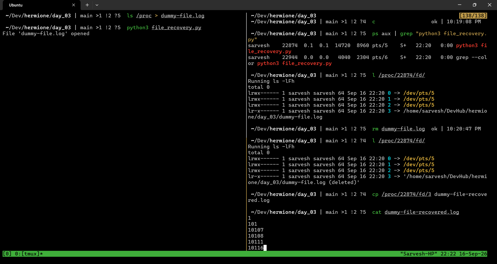

# Notes - Day 3

## Experiments

- Lab 3.1: Understanding and Observing syscalls using `strace` - [terminal_1.md](terminal_1.md)
    - Running `strace` on `ls`, `cat`
- Lab 3.2: Watching Network Syscalls Live - [terminal_2.md](terminal_2.md)
    - Running `strace` on `curl` and capturing network syscalls
- Lab 3.3: Inspecting File Descriptors via `/proc` and `lsof` - [terminal_3.md](terminal_3.md)
    - Messing around with `/proc` and `fd` of processes

## More Notes

### Recovering a deleted file trick

- If a file is open in a program or process, even if it's deleted accidentally, it can be recovered using the fd of the program that maps to the file
- What I wrote above might not make sense, so here's the demo:

    

- `file_recovery.py` only opens the file and waits for an input
- We manually delete the `.log` file using `rm`, and the fd of the `python3` process says it's deleted, but the contents themselves weren't wiped from the drive since our python program still has it open.
- We recover that `.log` file using `python3` process's fd that points to the `.log` file.
- A simple `cp` works, and the file is recovered

### 3 Real Scenarios where `strace` could help debug

1. A program silently skips the custom config file and falls back to defaults / hardcoded config file
    - Running `strace` on the program might reveal the exact `syscall` which failed, `openat(path)` where the custom config file was supposed to exist, but the kernel couldn't get to it and says file doesn't exist.
    - We can fix the config file path, file name, or whatever went down earlier.
2. A program crashes with Access Denied message on start
    - Error message just says 'Access Denied', we don't know which file our program was denied access to.
    - Running `strace` on this program, again, might reveal exactly which `syscall` failed, and therefore we can fix the permissions on that specific file using `chmod` or `chown`
3. A process hangs without explanation and refuses to terminate
    - `strace -p <pid>` attaches to the live hung process
    - It prints everything right upto the blocking `syscall`. Might be a `connect()` call waiting indefinitely without a timeout.

## Gemini Explanations

### The Two Worlds: User Space vs. Kernel Space

Modern CPUs implement privilege rings (typically Ring 3 for user space and Ring 0 for kernel space).

- User Space (Ring 3): Where your applications live—bash, Python, curl, browsers, and your own compiled binaries. Code here runs in an isolated sandbox. It cannot touch raw memory outside its allocated virtual address space, nor can it execute privileged CPU instructions. If a user-space program goes rogue and segfaults, only that process dies; the OS survives.

- Kernel Space (Ring 0): Where the core Linux kernel executes with total, unrestricted hardware access. The kernel coordinates memory allocation, hardware drivers, process scheduling, and network interfaces.

Because user space cannot access hardware directly, it must ask the kernel to act on its behalf. That formal request is a system call (syscall).

### What Happens During a Syscall?

When a program calls a high-level function like `printf()` or `open()`, it doesn't instantly jump to disk or display hardware.

1. The Library Wrapper: The language runtime or C standard library (`glibc` or `musl`) packs the syscall arguments into specific CPU registers (like `rax`, `rdi`, `rsi` on x86_64).

2. The Trap / Context Switch: The CPU executes a special machine instruction (such as `syscall` on modern 64-bit systems). This halts user-space execution, raises CPU privilege to Ring 0, saves the current process registers, and jumps execution straight into the kernel's Syscall Table.

3. Kernel Execution: The kernel verifies the arguments, checks permissions (e.g., Does this user actually own this file?), executes the driver operation, and grabs the result.

4. Return to User Mode: The CPU state flips back to Ring 3, passes the return value (or an error code like `-EACCES` / `-ENOENT`) back via a register, and execution resumes in your application.

### File Descriptors (`fd`)

Linux follows the classic design rule: almost everything is exposed as a stream of bytes.

To prevent user processes from dealing with physical disk sectors or hardware buffer offsets, the kernel gives each process a private lookup table called the File Descriptor Table.

A file descriptor (fd) is an integer index (0, 1, 2, 3...) pointing to an entry in this internal kernel table.

| FD Number | Default Stream   | What It Represents                                   |
| --------- | ---------------- | ---------------------------------------------------- |
| 0         | `stdin`          | Standard Input (usually your keyboard)               |
| 1         | `stdout`         | Standard Output (usually your terminal screen)       |
| 2         | `stderr`         | Standard Error (unbuffered error messages to screen) |
| 3+        | Custom / Dynamic | Open files, network sockets, pipes, and event loops  |

Whether an application opens a text file, creates an inter-process pipe, or establishes a TCP connection to `example.com`, the kernel hands back a number. Reading from a file or reading from a network socket both invoke the exact same family of syscalls: `read()` and `write()`.

### Commands and Tools

Normally, the transition between user space and kernel space happens invisibly in microseconds. When software fails silently, hangs, or behaves strangely, traditional stack traces only tell you what the application thinks it is doing.

- `strace`: Uses the kernel’s internal `ptrace` mechanism to intercept and log every single system call a process attempts to cross into Ring 0, complete with arguments and return codes. If an application fails because an obscure configuration file in `/etc/` is missing, `strace` shows the exact `openat()` call returning `-1 ENOENT (No such file or directory)`.

- `/proc/<PID>/fd/`: The `/proc` filesystem is an in-memory window into the kernel's state. Checking `/proc/<PID>/fd/` exposes the live symlinks for every open descriptor that specific process currently holds.

- `lsof` ("List Open Files"): A utility that aggregates `/proc` data across processes, showing not just files, but active network connections, UNIX domain sockets, and mapped shared libraries (`.so`).

## My Notes

1. It's pretty neat, how everything an application in user space asks for from the kernel, it just gives a stream of bytes in the form of a file descriptor (`fd`). A network socket for a TCP connection, an open file, piping from another program, piping to another program, it all becomes accessible like they're just files with the `fd`.
2. I'm kind of surprised I understood everything I've read till now. Even the commands, I think I understand what `strace` does, what's in `/proc/<PID>/fd/`, and what `lsof` consolidates and reports.

### Network Syscalls

In Linux, a network connection is treated almost identically to a file on disk. You don't have a magical "send internet packet" instruction; instead, you ask the kernel to create a communication endpoint, and the kernel hands you back a file descriptor.

From that point forward, you can read() and write() to it just like /etc/hosts.

### The Network Lifecycle: The Big 5 Syscalls

Every client-side network interaction (like curl, a browser tab, or an API call) follows a strict sequence of syscalls to cross the kernel boundary:

1. socket(...) = fd
    - Tells the kernel: "Create a communication endpoint for me."
    - You specify the domain (IPv4 AF_INET or IPv6 AF_INET6) and the protocol type (TCP SOCK_STREAM or UDP SOCK_DGRAM).
    - Return value: A fresh file descriptor (often 3 or higher).

2. connect(fd, {IP, port}, ...)
    - Tells the kernel: "Initiate a connection on this fd to a specific destination IP and port."
    - For TCP, this is where the kernel takes over and completes the TCP 3-way handshake (SYN -> SYN-ACK -> ACK) under the hood.

3. sendto() or write()
    - Tells the kernel: "Push these bytes out through this socket fd."
    - For HTTP, this buffer contains your plaintext request, such as GET / HTTP/1.1\r\nHost: example.com\r\n....

4. recvfrom() or read()
    - Tells the kernel: "Fill my memory buffer with whatever incoming packets arrived for this socket fd."
    - It blocks or waits until the server responds, then returns the byte count and data (e.g., HTTP/1.1 200 OK...).

5. close(fd)
    - Tells the kernel: "I'm done with this endpoint. Tear down the connection (FIN/RST handshake) and free up the descriptor in my table."
