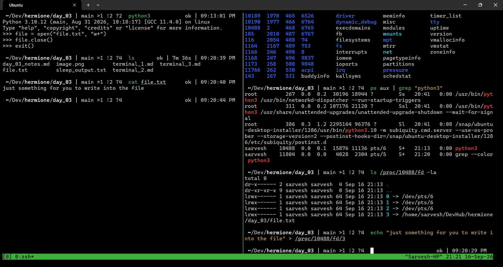

# Exercise 3.2 Terminal Outputs

1. Redirect `sleep`'s stdout to a file

```bash
sleep 1000 > sleep_output.txt &
```

2. Look at the `fd` of that sleep process
    - fd 1, stdout, points to the file we directed the output to using output redirection `>`

```bash
ls -l /proc/$!/fd/
```

```text
ls /proc/5382/fd/ -l
total 0
lrwx------ 1 sarvesh sarvesh 64 Sep 16 16:45 0 -> /dev/pts/5
l-wx------ 1 sarvesh sarvesh 64 Sep 16 16:45 1 -> /home/sarvesh/DevHub/hermione/day_03/sleep_output.txt
lrwx------ 1 sarvesh sarvesh 64 Sep 16 16:45 2 -> /dev/pts/5
lrwx------ 1 sarvesh sarvesh 64 Sep 16 16:45 7 -> /dev/ptmx
```

3. `lsof -p <pid>`
    - cwd: current working directory (where the process was spawned from)
    - rtd: root directory
    - txt: the compiled binary code of the program
    - mem: C runtime libraries mapped into the process's virtual memory space
    - permissions: u -> read and write, w -> write only

```bash
lsof -p $!
```

```text
COMMAND  PID    USER   FD   TYPE DEVICE SIZE/OFF   NODE NAME
sleep   5382 sarvesh  cwd    DIR   8,48     4096  22602 /home/sarvesh/DevHub/hermione/day_03
sleep   5382 sarvesh  rtd    DIR   8,48     4096      2 /
sleep   5382 sarvesh  txt    REG   8,48    35336  26121 /usr/bin/sleep
sleep   5382 sarvesh  mem    REG   8,48   353616  14185 /usr/lib/locale/C.utf8/LC_CTYPE
sleep   5382 sarvesh  mem    REG   8,48  2220400 161791 /usr/lib/x86_64-linux-gnu/libc.so.6
sleep   5382 sarvesh  mem    REG   8,48       50  14833 /usr/lib/locale/C.utf8/LC_NUMERIC
sleep   5382 sarvesh  mem    REG   8,48     3360  14836 /usr/lib/locale/C.utf8/LC_TIME
sleep   5382 sarvesh  mem    REG   8,48     1406  14184 /usr/lib/locale/C.utf8/LC_COLLATE
sleep   5382 sarvesh  mem    REG   8,48      270  14831 /usr/lib/locale/C.utf8/LC_MONETARY
sleep   5382 sarvesh  mem    REG   8,48       48  14830 /usr/lib/locale/C.utf8/LC_MESSAGES/SYS_LC_MESSAGES
sleep   5382 sarvesh  mem    REG   8,48       34  14834 /usr/lib/locale/C.utf8/LC_PAPER
sleep   5382 sarvesh  mem    REG   8,48       62  14832 /usr/lib/locale/C.utf8/LC_NAME
sleep   5382 sarvesh  mem    REG   8,48      127  14183 /usr/lib/locale/C.utf8/LC_ADDRESS
sleep   5382 sarvesh  mem    REG   8,48       47  14835 /usr/lib/locale/C.utf8/LC_TELEPHONE
sleep   5382 sarvesh  mem    REG   8,48       23  14189 /usr/lib/locale/C.utf8/LC_MEASUREMENT
sleep   5382 sarvesh  mem    REG   8,48    27002 209763 /usr/lib/x86_64-linux-gnu/gconv/gconv-modules.cache
sleep   5382 sarvesh  mem    REG   8,48   240936 161788 /usr/lib/x86_64-linux-gnu/ld-linux-x86-64.so.2
sleep   5382 sarvesh  mem    REG   8,48      258  14186 /usr/lib/locale/C.utf8/LC_IDENTIFICATION
sleep   5382 sarvesh    0u   CHR  136,5      0t0      8 /dev/pts/5
sleep   5382 sarvesh    1w   REG   8,48        0  52276 /home/sarvesh/DevHub/hermione/day_03/sleep_output.txt
sleep   5382 sarvesh    2u   CHR  136,5      0t0      8 /dev/pts/5
sleep   5382 sarvesh    7u   CHR    5,2      0t0     86 /dev/ptmx
```

## One more experiment

- I ran python interactive on one pane and opened a file "file.txt" inside it.
- On another pane, I checked the PID of the interactive python, and looked at its `fd`s.
- There it was, the open file, on `fd` 3

- Writing into the file using the python process's file descriptor

    
