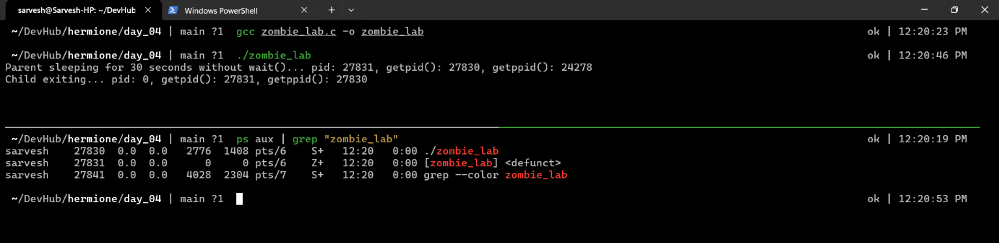
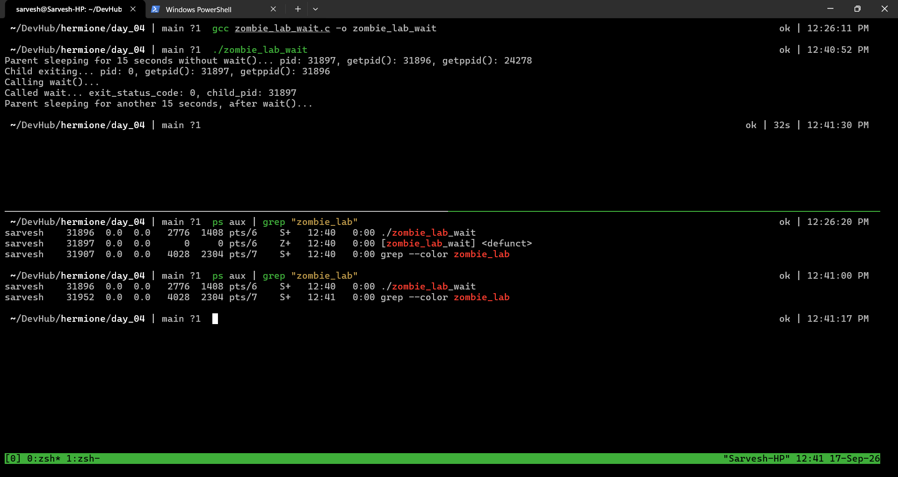

# Exercise 4.1 Terminal Outputs

1. `zombie_lab.c` is compiled and run
    - It creates a child process, exits it immediately, but sleeps the parent for 30 seconds without calling `wait()`
    - In those 30 seconds, the child process is a textbook zombie process

```bash
gcc zombie_lab.c -o zombie_lab
./zombie_lab
```

2. Output
    - In the parent
        - `pid` variable contains the child's pid, return value of `fork()`
        - `getpid()` returns the pid of the parent
        - `getppid()` returns the pid of the parent `zombie_lab` program's parent, which is a `zsh` process, an instance of `/usr/bin/zsh`
    - In the child
        - `pid` variable is just `0`
        - `getpid()` returns the pid of the child, in this case, `23747`
        - `getppid()` returns the parent `zombie_lab`'s pid, which is `23746`

```text
Parent sleeping for 30 seconds without wait()... pid: 23747, getpid(): 23746, getppid(): 22599
Child exiting... pid: 0, getpid(): 23747, getppid(): 23746
```

3. Demonstration
    - We can see that `ps aux | grep 'zombie_lab'` shows us the pid `23747`, the child `zombie_lab` process, is in `Z+` state, confirming that the child is indeed a zombie
    - Once the parent dies, the child is adopted by `systemd`, pid 1, and it calls `wait()` for the child, taking it out of the zombies list.

    

4. Another (better) demonstration
    - This program does almost the same thing, but instead of just sleeping for 30 seconds, it sleeps for 15 seconds, calls `wait()`, and sleeps for another 15 seconds.
    - Here, it's clear that when the parent hasn't called wait, the child is a zombie.
    - Once the parent calls `wait()`, the child is no longer a zombie.

    

5. Output of better demonstration

```text
Parent sleeping for 15 seconds without wait()... pid: 31897, getpid(): 31896, getppid(): 24278
Child exiting... pid: 0, getpid(): 31897, getppid(): 31896
Calling wait()...
Called wait... exit_status_code: 0, child_pid: 31897
Parent sleeping for another 15 seconds, after wait()...
```
