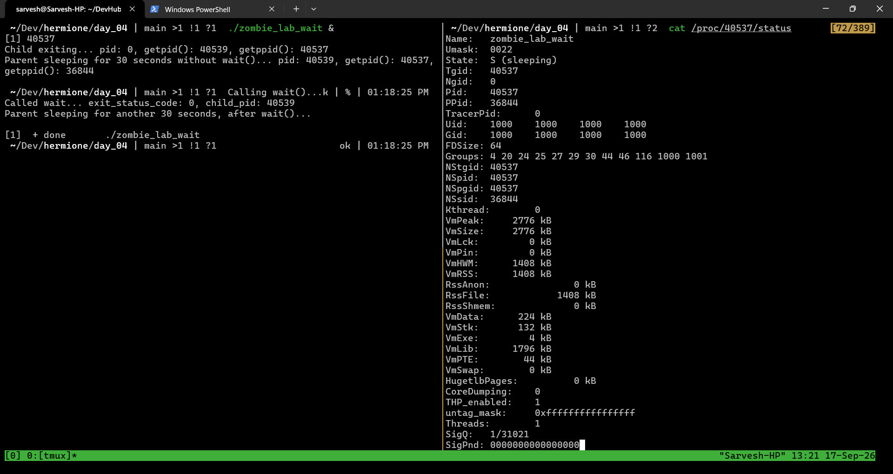
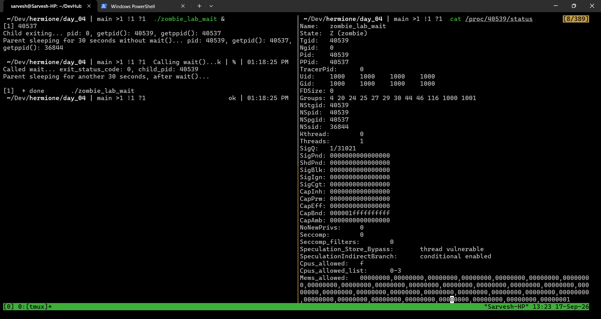
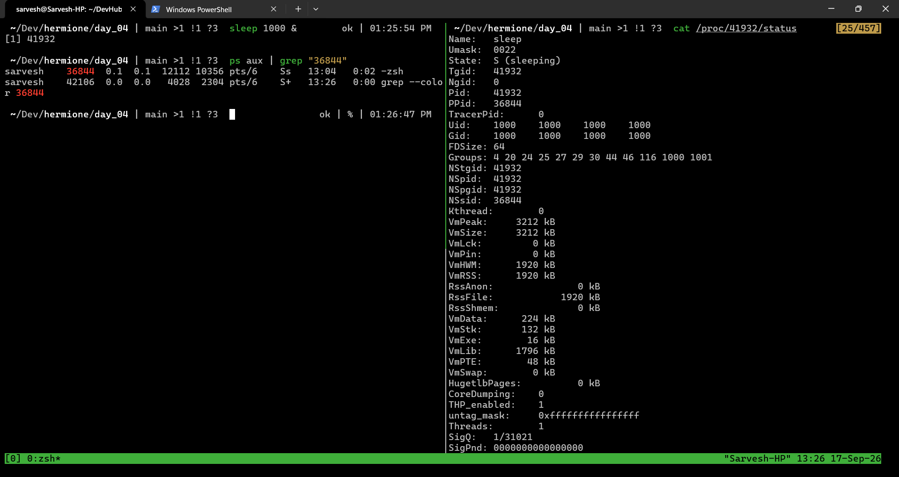
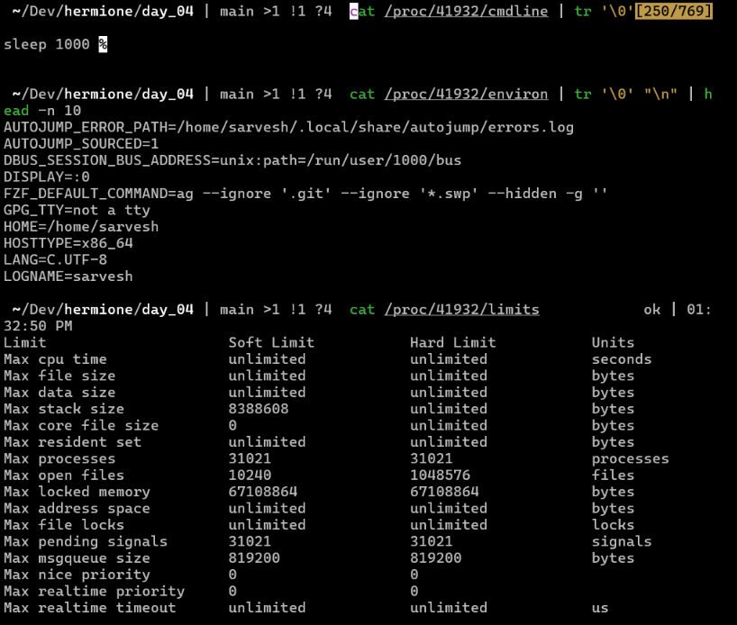
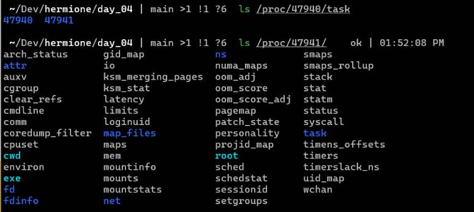
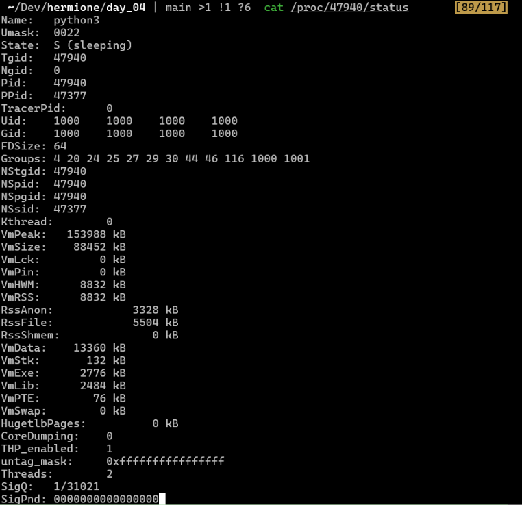
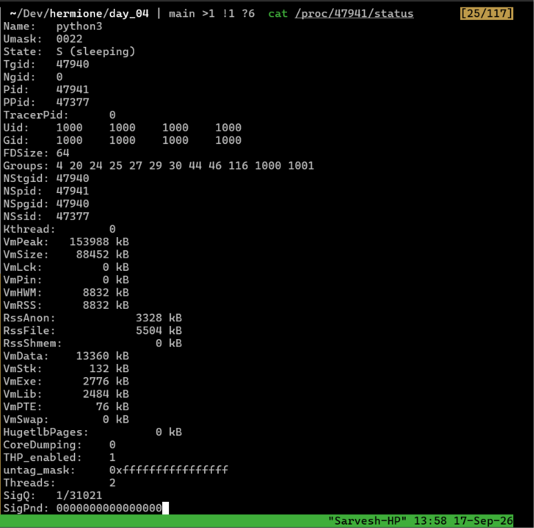

# Exercise 4.2 Terminal Outputs

## Demo with `zombie_lab_wait`

- Screenshot of parent `zombie_lab_wait` process's status before it was done
  

- Screenshot of child `zombie_lab_wait` process's status before parent called `wait()`
  
- Even thought the left pane says the parent is done, the `cat /proc/<childPID>/status` command was run before `wait()` call

- After the wait() call, `/proc/<childPID>/` directory was gone

## More `/proc/<pid>/` files

- `cmdline`, `environ`, `limits`
  
  

## IMPORTANT NOTE: FORK DOES NOT CREATE A THREAD. IT CREATES A CHILD PROCESS

- So the child doesn't get an entry in `/proc/<parentPID>/task/`
- I was trying to find `<childPID>` in `/proc/<parentPID>/task` while running `zombie_lab_wait` only to learn this now.

## Threading

- `threads.py` creates a thread and asks it to sleep for 5 minutes, and goes to sleep for 5 minutes

- Created thread is visible:

    

### Status Comparison

|         Python Main Process (`/proc/<pid>/status`)         |           Created Thread (`/proc/<threadPID>/status`)           |
| :--------------------------------------------------------: | :-------------------------------------------------------------: |
|  |  |
|               _Main process status metrics_                |                 _Worker thread status metrics_                  |

### Notes

- They have the same TGID and different PID
- Both are instances of `python3` program
- `Threads: 2` - two threads on the same thread group
- Both `status` outputs show identical memory footprints: `VmRSS`, `VmSize`, `VmStk`
