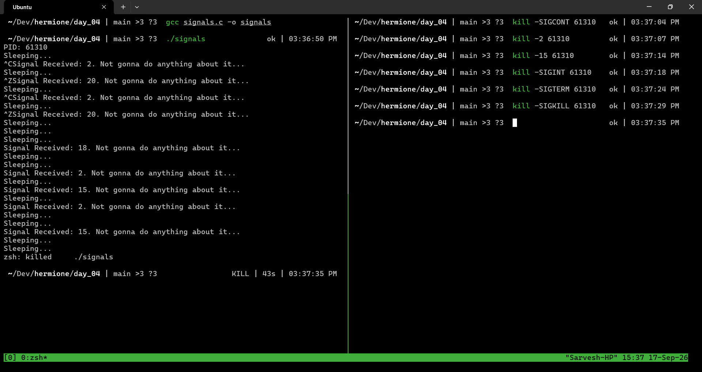

# Exercise 4.3 Terminal Outputs

## Notes

- The program handles the signals `SIGTERM`, `SIGINT`, `SIGCONT`, `SIGTSTP`, but even though it attempts to handle `SIGKILL` and `SIGSTOP`, the kernel doesn't give it a chance to.
- The kernel executes the kill or stop in the kernel space and the process dies or stops.

## Demo of `signals` program

- The program `signals.c` handles `SIGINT`, `SIGTERM`, `SIGCONT`, `SIGTSTP`

