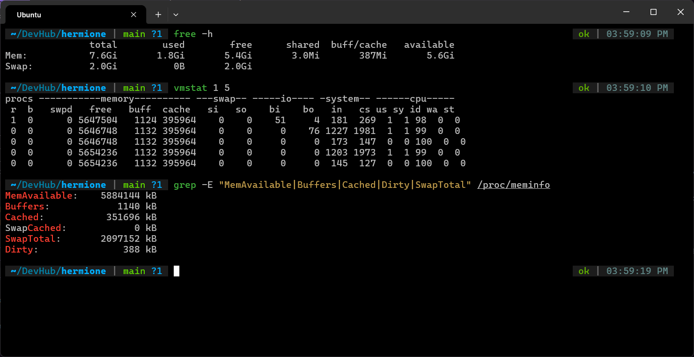

# Exercise 5.1 Terminal Outputs

1. Outputs

    

2. `free -h` and `vmstat`
    - `free -h`: human readable summary of memory statistics
    - `vmstat 1 5`: This tracks system performance across 5 samples taken 1 second apart

3. `free -h` output
    - Lists total, used, free, buff/cached and available memory
    - Notice how available > free. Some of the buff/cached is available to be overwritten when necessary

4. `vmstat` output

    This tracks system performance across 5 samples taken 1 second apart:
    - **`procs`** (**`r`**, **`b`**):
        - `r`: Runnable processes waiting for CPU time (mostly `0` or `1` here, meaning no CPU bottleneck).
        - `b`: Uninterruptible sleep (processes blocked on disk I/O); `0` means zero I/O wait.

    - **`memory`** (**`free`**, **`buff`**, **`cache`**): Raw values in KiB. Notice how `free` drops slightly across samples as background processes allocate memory.

    - **`swap`** (**`si`**, **`so`**): Swap in / Swap out. Both are `0`, confirming the kernel hasn't touched the disk swap partition.

    - **`io`** (**`bi`**, **`bo`**): Blocks received from / sent to block devices (disk activity).

    - **`system`** (**`in`**, **`cs`**): Interrupts and Context Switches per second.

    - **`cpu`** (**`us`**, **`sy`**, **`id`**, **`wa`**, **`st`**): User, System, Idle, Wait for I/O, and Steal time. The CPU is ~98–100% idle (`id`).

5. `/proc/meminfo` output
    - It contains a lot of data, we only look at what we want with `grep`
    - This file contains the raw data, both `free` and `vmstat` get their data from here
    - `MemAvailable`: Kernel's estimate of available memory
    - `Cached`: page cache holding recently written and read file data
    - `Dirty`: file pages in RAM that have been modified, but not have been flushed to disk. Kernel will write those asynchronously using flushing threads.

6. Difference between `available` and `free` memory
    - Free memory is the total unused memory that's doing nothing. Nothing's in them.
    - Available memory includes free memory, and the Page cache memory that is available to be cleared and used for any program that might need it.
