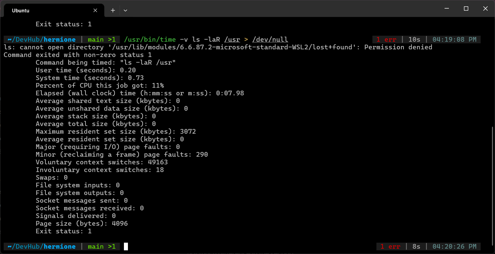
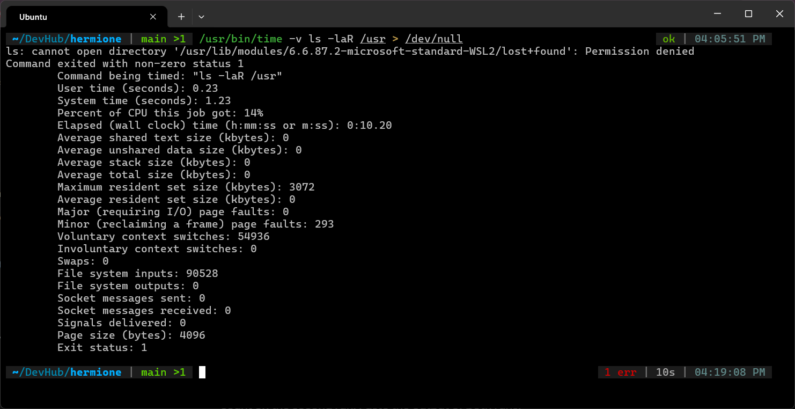
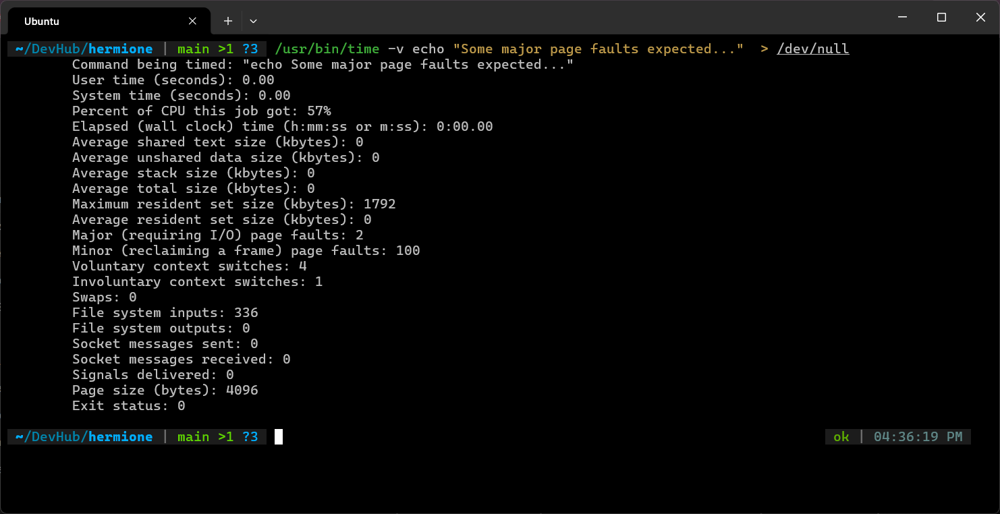
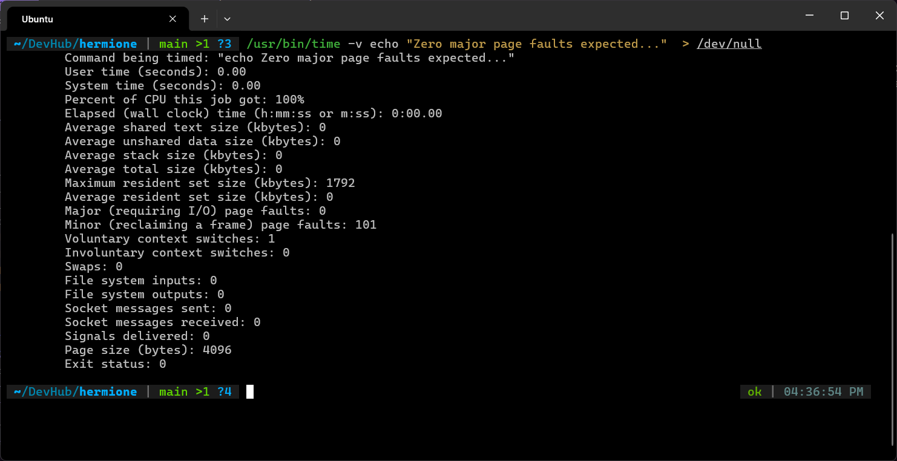

# Exercise 5.1 Terminal Outputs

1. Outputs of `/usr/bin/time -v ls -laR /usr > /dev/null`
    - `ls` doesn't cause major page faults because it doesn't load files or binaries into it's own memory space. Instead, it uses regular system calls to ask the kernel to traverse directories.

    - Run 1:
      

    
    - Differences
        1. **File system inputs:** Dropped from **90,528** to **0**.
        2. **System time:** Dropped from **1.23s** to **0.73s** (a \~40% reduction).
        3. **Elapsed wall-clock time:** Dropped from **10.20s** to **7.98s**.

2. Outputs of `/usr/bin/time -v echo "..." > /dev/null`
    - `echo` not in page cache. triggers major page faults. then loaded into page cache
    - 

    - `echo` already in page cache. no major page faults.
    - 
