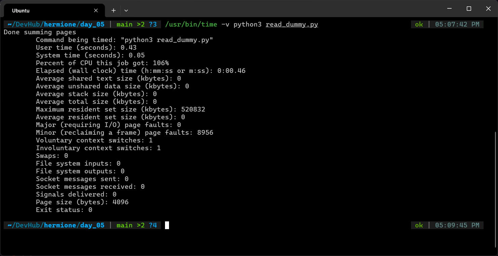

# Exercise 5.3 Terminal Outputs

1. Creating a 500MB `dummyfile`

    ```bash
    dd if=/dev/urandom of=dummyfile bs=1M count=500
    ```

2. Clearing system page cache

    ```bash
    sync; echo 3 | sudo tee /proc/sys/vm/drop_caches
    ```

3. Running the `read_dummy.py` to touch every page in the `dummyfile`

    ```bash
    /usr/bin/time -v python3 read_dummy.py
    ```

    - First run results in thousands of Major Page Faults (4017 major page faults)

        

    - Second run results in zero Major Page Faults

        

    - Clearly, the Page Cache is in action

    - The second read pulled the data from page cache and caused zero major page faults, and much faster access time

    - But, the major page faults in the first run were just converted to minor page faults in the second run.

    - Cold Run: Major 4017 + Minor 4949 = 8966

    - Warm Run: Major 0 + Minor 8956 -> almost tallying

    - Cold Run: CPU had to wait for I/O, so the CPU usage is 52%

    - Warm Run: Only operations were to read and write from RAM, which is CPU's work. It even hit brief OS-level parallelism and hit 106%.

    - Voluntary Context Switches in cold run were 2694, In the warm run, there was 1.

    - During the cold run, CPU had to wait for I/O, so the cycles were used by other processes, and therefore a lot of voluntary context switches

    - In the warm run, CPU didn't have to wait for anything. Only limiting factor in throughput was the CPU-RAM bandwidth so CPU almost never stopped working.

    - Cold read takes 0.40s of system time, Warm read takes 0.05s of system time. 8x faster

    - Wall clock time has dropped from 0.83s to 0.46s, 1.8x overall speedup

    - File System Inputs value has also dropped to zero in the warm run
