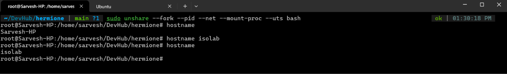
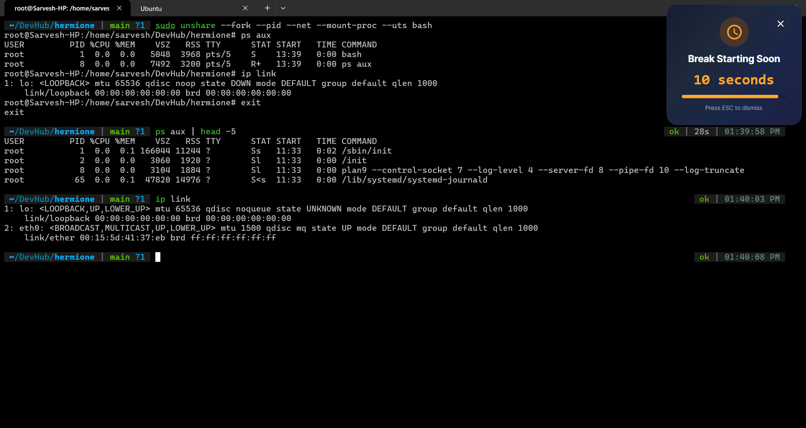

# Exercise 6.1 Terminal Outputs

1. `unshare` and `hostname`

    

2. `hostname` remains unchanged in the host terminal, even though inside the namespace it's changed
    - `hostname` in a different shell session says `Sarvesh-HP`

3. PID Virtualization, Mount Isolation and Empty Network Stack
    - `bash` is the container process and it runs inside four blank namespaces isolated from the system
    - `bash` gets it's init-pid of 1
    - `ps aux` only lists processes inside this container, meaning `/proc` is isolated from the main system's `/proc` virtual mount
    - `ip link` only shows loopback, a new empty network stack for this container

    
