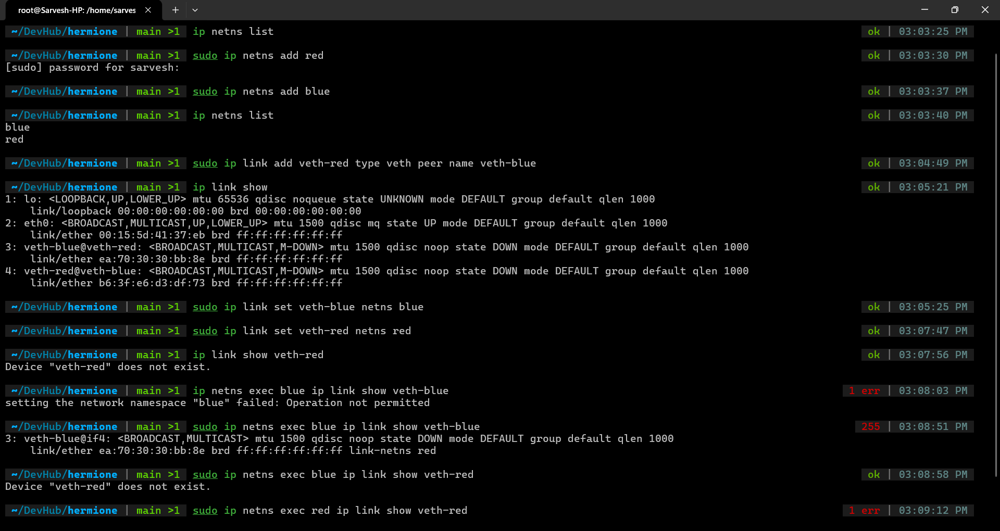
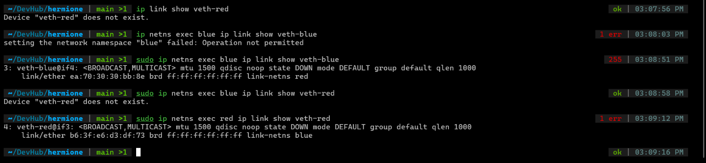
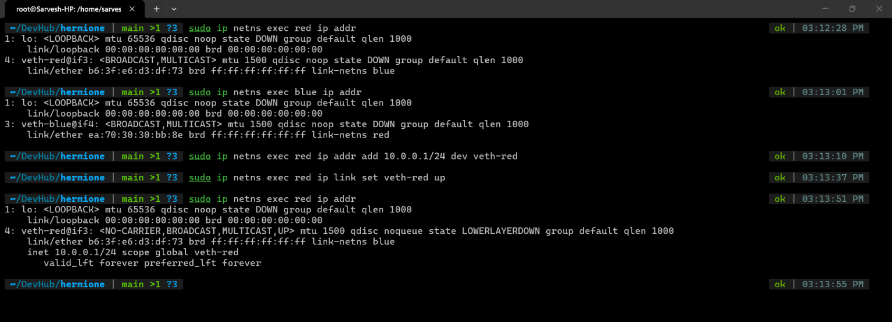
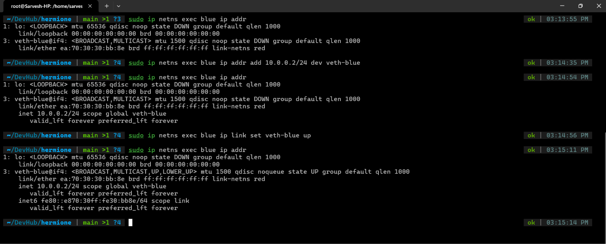
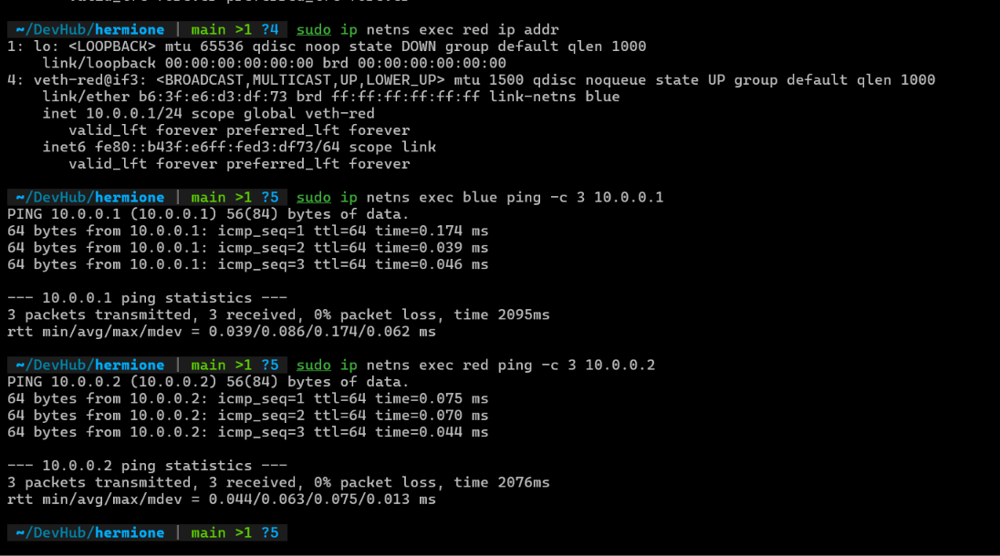
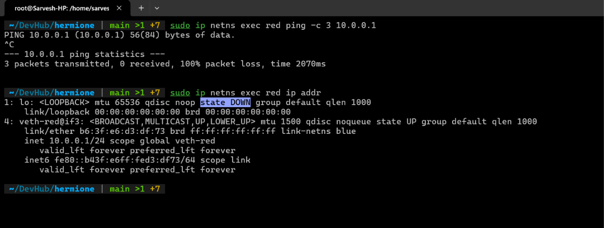
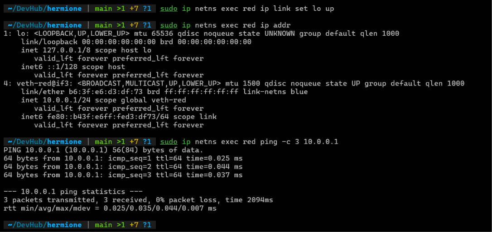

# Exercise 6.2 Terminal Outputs

## Running the commands



1. Creating new network namespaces

    ```bash
    sudo ip netns add red
    sudo ip netns add blue
    ```

2. Creating a `veth` pair, `veth-red` and `veth-blue`

    ```bash
    sudo ip link add veth-red type veth peer name veth-blue
    ```

3. `ip link show` shows the links present. Shows both ends of the `veth` pair.

4. Setting each end of the `veth pair` to the be in the respective `netns`

    ```bash
    sudo ip link set veth-blue netns blue
    sudo ip link set veth-red netns red
    ```

5. Namespace isolation
    - After last step, the host system cannot see `veth-blue` or `veth-red` links
    - Only `blue` netns can see `veth-blue` and vice versa.
    - To do anything with veth-blue, we use

    ```bash
    sudo ip netns exec <namespace> <command>
    ```

6. Looking at the `ip link` from the namespaces
    - `veth-red` doesn't show up when executing from `blue` and vice versa

    ```bash
    sudo ip netns exec blue ip link show veth-blue
    sudo ip netns exec red ip link show veth-red
    ```

    

7. Adding IP Addresses to each veth device `veth-red` and `veth-blue` and bringing the interfaces up

    ```bash
    sudo ip netns exec red ip addr add 10.0.0.1/24 dev veth-red
    sudo ip netns exec red ip link set veth-red up

    sudo ip netns exec blue ip addr add 10.0.0.2/24 dev veth-blue
    sudo ip netns exec blue ip link set veth-blue up
    ```

    - Also the output of `ip addr` commands tell us that the namespaces are linked and the `veth` device is UP and ready to go

    ```bash
    sudo ip netns exec red ip addr
    sudo ip netns exec blue ip addr
    ```

    

    

8. Pinging one device from the other

    ```bash
    sudo ip netns exec red ping -c 3 10.0.0.2
    sudo ip netns exec blue ping -c 3 10.0.0.1
    ```

    

## Experiments

1. I found that pinging `10.0.0.1` from red didn't work, and neither did pinging `10.0.0.2` from blue namespace.

2. It was because the `lo` interface in both were DOWN

    

3. I'm fixing it by bringing it up.

    ```bash
    sudo ip netns exec red ip link set lo up
    ```

    - After this command, the `lo`'s `state` changed from `DOWN` to `UNKNOWN`

        
