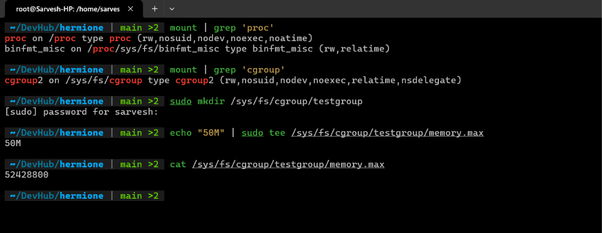
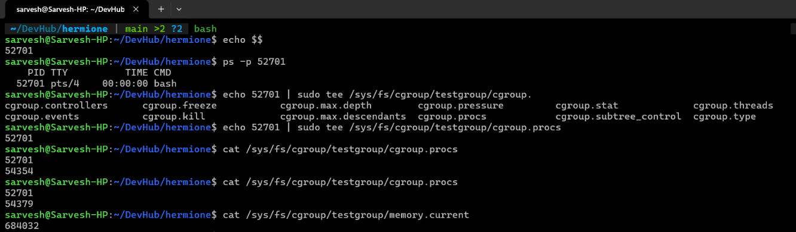
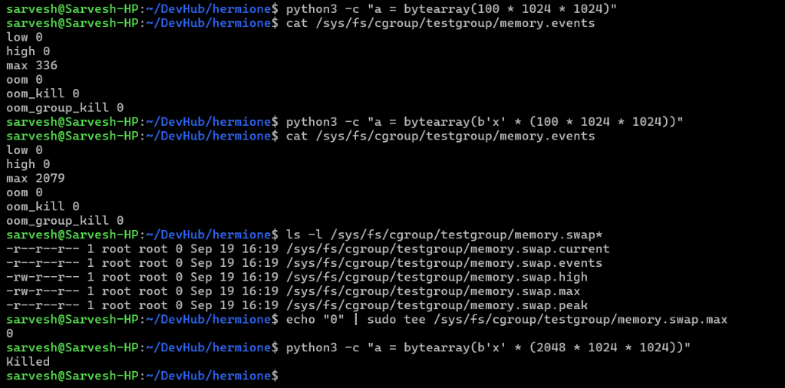
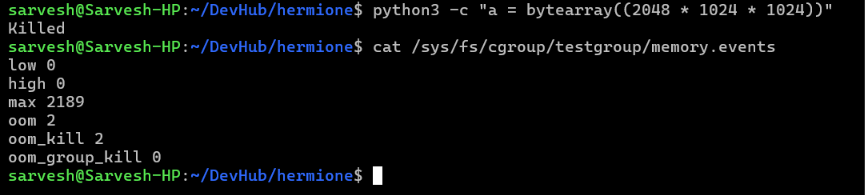

# Exercise 6.3 Terminal Outputs

1. Looking at `mount` output and creating a `cgroup`, assigning a `memory.max` of `50M`

    

2. Creating a new `bash` process and writing its PID to `/sys/fs/cgroup/testgroup/cgroup.procs`

    

3. Hitting the ceiling with `python`
    - The python line hit the max multiple times, but it started using swap memory and evaded being killed
    - Once we set the `memory.swap.max` to `0`, `python` had to be killed by OOM Killer

    

    
