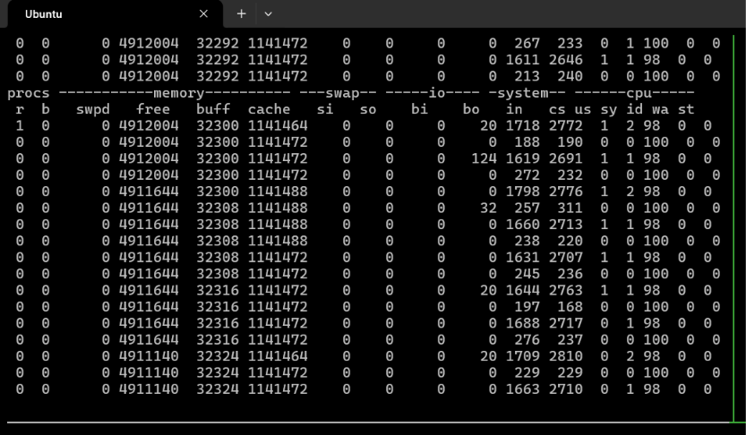
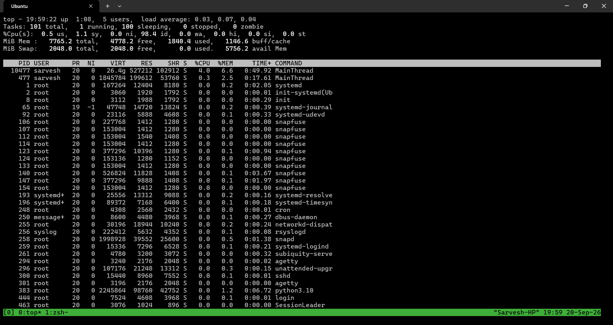
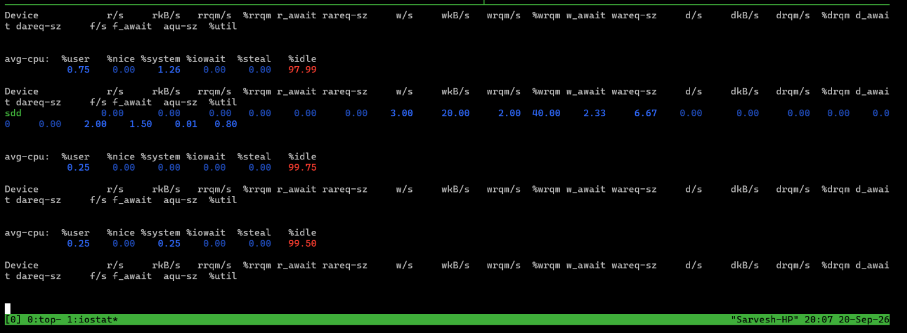
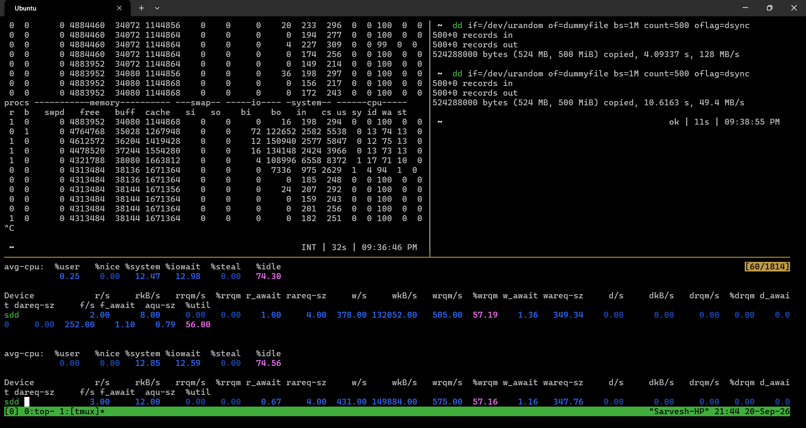
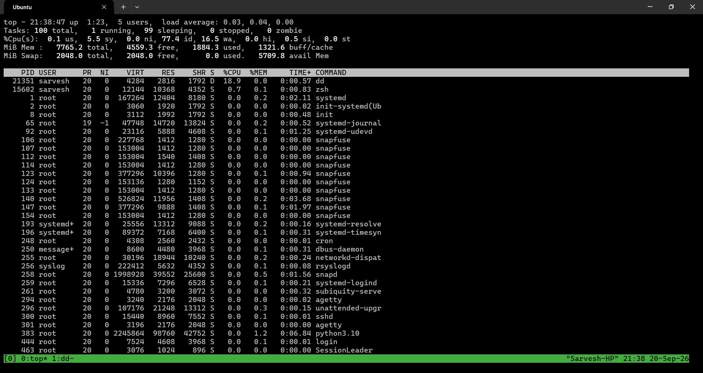

Logs before bottleneck

1. `vmstat 1` and `top`
- Current CPU Load Average: 0.03, 0.07, 0.04
- Current `%wa` (I/O wait): 0.00 in `top` and 0 in `vmstat`
- `vmstat`'s `b` (blocked processes) column: 0

   

   

2. `iostat -xz 1`
- `%util` (device utilization): 0.80
- `w_wait` (write latency in ms): 2.33
- `aqu-sz` (average queue size): 0.01

    

Creating a bottleneck

