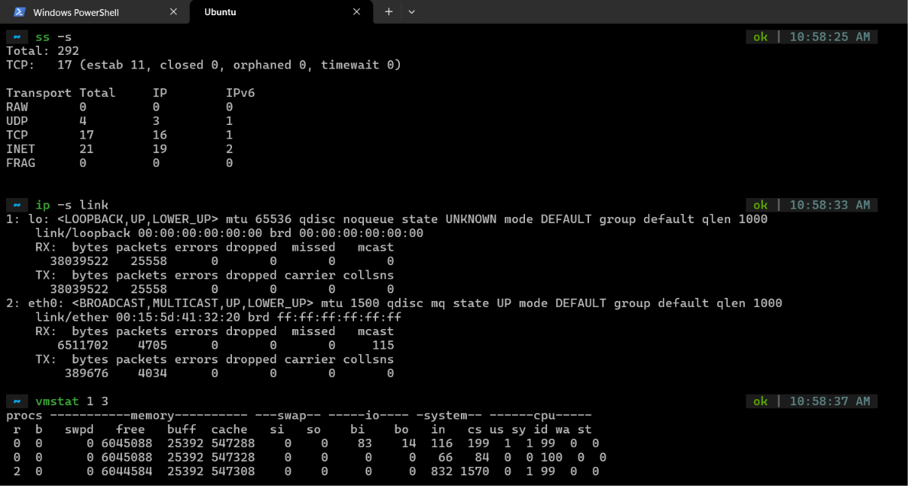
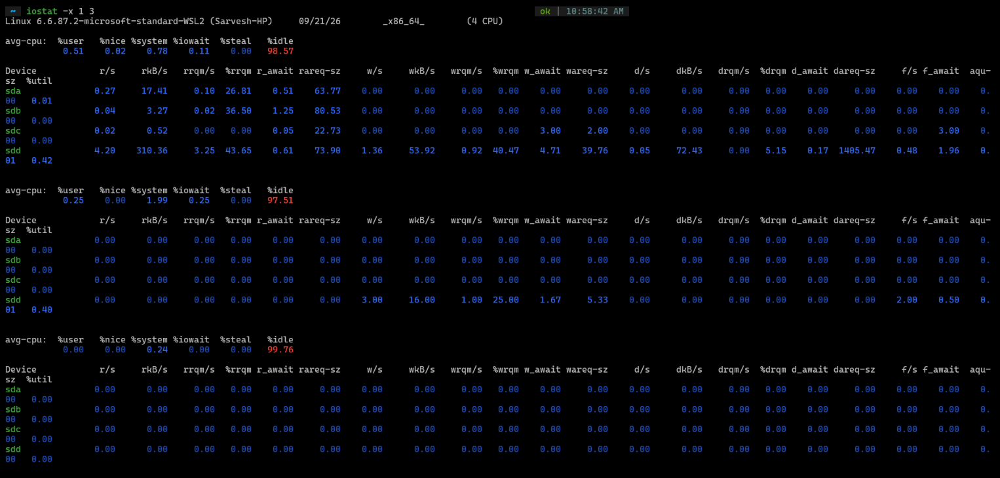
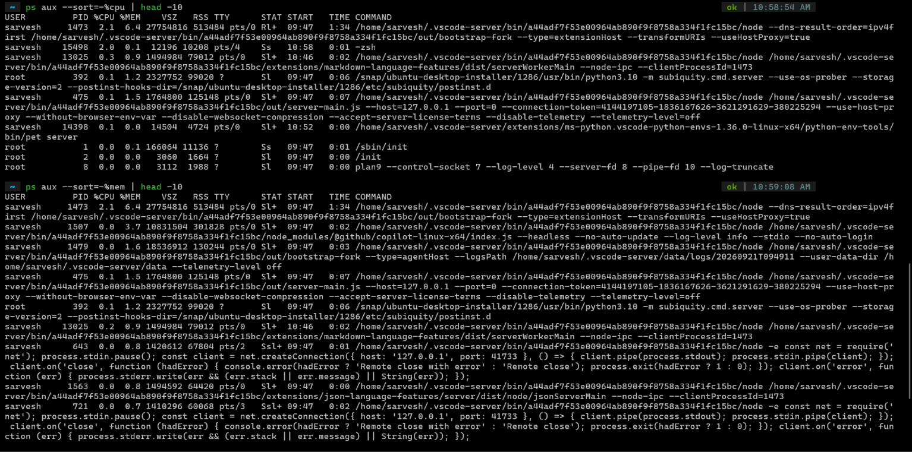

# Exercise 7.2 Terminal Outputs

## 1. Commands

- Socket Statistics Summary
- Network Interface operational statuses and data transfer statistics
- Virtual Memory Statistics (1 second window, 3 intervals)
- Extended Disk I/O statistics (1 second window, 3 intervals)

```bash
ss -s
ip -s link
vmstat 1 3
iostat -x 1 3
ps aux --sort=-%cpu | head -10
ps aux --sort=-%mem | head -10
```







## 2. Analysis

1. `ss -s`
   - `TCP:   17 (estab 11, closed 0, orphaned 0, timewait 0)`
   - Healthy system state, no orphaned and timewait is 0

2. `ip -s link`
   - `eth0: 0 drops, 0 errors on RX and TX`
   - Ideal network interface state. No errors and no packets dropped

3. `vmstat 1 3`
   - Blocked tasks (b): 0, Paging (si/so - swap in/out): 0/0,
   - Memory: ~6GB free, Swap: unused
4. `iostat -x 1 3`
   - Disk utilization (`%util`): 0.00%, Avg. queue size (`aqu-sz`): 0.01, Latency (`w_await`): <5ms

5. `ps aux --sort=...`
   - Top consumer of CPU
     - VS Code Server extension host (node/vscode) (PID 1473) consuming 2.1% of CPU
   - Top consumer of memory
     - The same VS Code Server extension host (PID 1473) consuming 6.4% of Memory, ~513484 KB RSS (513MB)

## Diagnosis Steps

When running a diagnostic scan in a situation, we are checking for red flags in this order:

1. Are sockets exhausted or dropped? (`ss -s`, `ip -s link`)

2. Is the machine paging memory to disk? (`vmstat` -> `si/so`)

3. Are processes stuck waiting for disk? (`vmstat` -> `b`, `iostat` -> `%util`, `%wa`)

4. Is a specific PID consuming all CPU or RAM? (`ps aux`)
